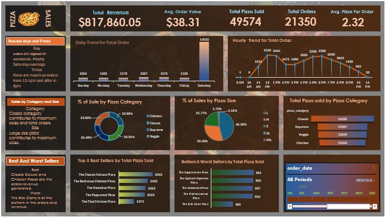

#  Dashboard Preview

---

# Pizza Sales Dashboard (Excel)

This Excel-based dashboard project was created to analyze pizza sales data and extract key business insights. It demonstrates how Excel can be used as a powerful BI tool to drive data-informed decision-making.

---

## Project Objectives

The primary goal of this project was to analyze pizza sales data to uncover business insights and make data-driven decisions. This Excel dashboard provides answers to the following key business questions:

- What are the total revenue, average order value, and total number of pizzas sold?
- Which pizza categories, sizes, and types are top performers?
- What are the busiest days and times for pizza orders?
- Who are the best-selling and worst-selling pizza types?
- How can business operations be optimized based on customer behavior?

---

## Project Insights

- **Saturday dominates sales**, contributing the most to daily revenue and orders. Special promotions or staffing can be planned accordingly.
- **Lunch (12–1 PM)** and **dinner hours (4–8 PM)** are the busiest times; marketing efforts can be focused on these slots.
- **Classic pizzas** and **large-sized pizzas** generate the highest revenue — showing customer preference for traditional and shareable options.
- Top-selling pizzas include **classics and chicken-based flavors**, while vegetarian and gourmet variants tend to underperform.
- Strategic decisions like **phasing out underperforming pizzas** or **bundling bestsellers** can help maximize profits.

---

##  Final Conclusion

This Excel-based pizza sales dashboard provides clear, actionable insights into:

- Customer behavior  
- Product performance  
- Time-based trends

It empowers business stakeholders to:

- Identify best and worst-performing products  
- Optimize operations around peak hours  
- Enhance inventory planning and staffing  
- Design data-driven marketing and promotional strategies  

>  **Conclusion:** The dashboard proves how even with Microsoft Excel, we can build powerful analytics tools to drive real business value.

---

##  Tools Used
- Microsoft Excel (Pivot Tables, Charts, Slicers, Conditional Formatting)

---

##  Connect

If you liked this project, feel free to connect with me on [Sneha's LinkedIn](https://www.linkedin.com/in/sneha-jamadagni/) or explore more projects on my [Sneha's GitHub profile](https://github.com/SnehaJamadagni15).

